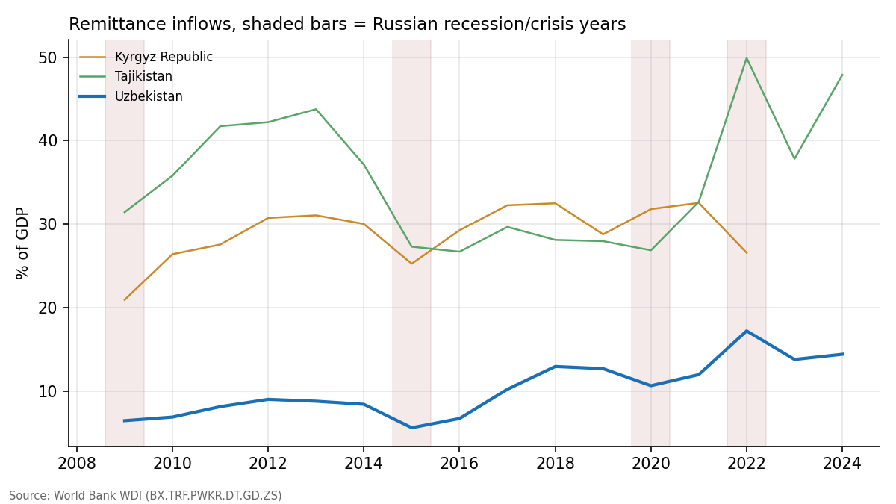
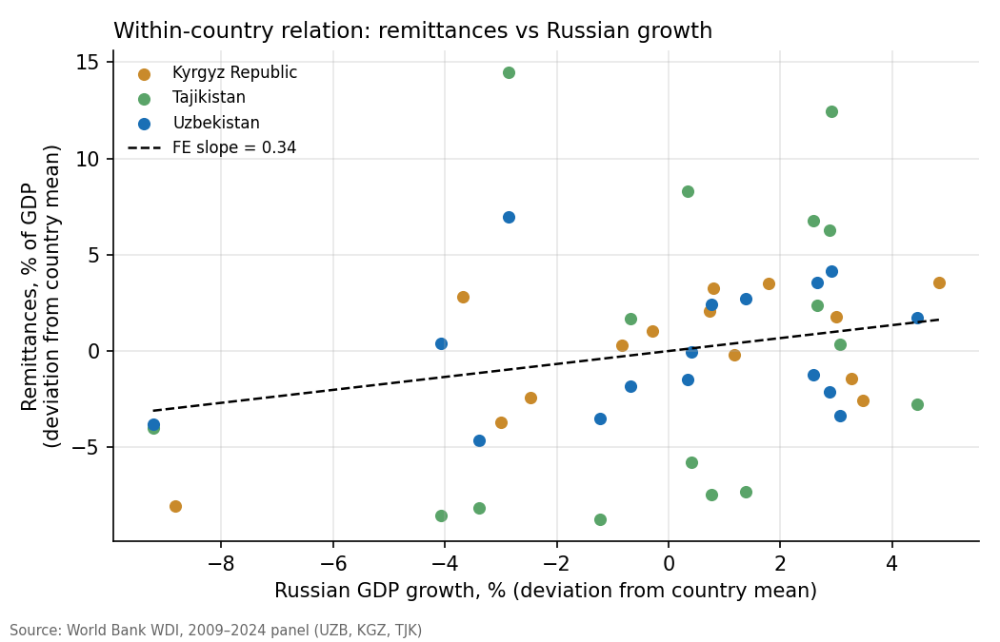

# What Drives Remittances to Central Asia?

A country fixed-effects panel of remittance inflows to Uzbekistan, the Kyrgyz Republic, and Tajikistan, 2009–2024.



## Question

Millions of Central Asian migrants work in Russia and send money home. Remittances are 14% of Uzbek GDP and near half of Tajik GDP. How tightly do these inflows follow conditions in Russia — its growth (demand for migrant labour) and its exchange rate (the dollar value of ruble earnings)?

## Data

Country-year panel built from the World Bank WDI (`R/01_build_panel.R`):

| Variable | Definition | WDI code |
|---|---|---|
| `remit_gdp` | Remittances received, % of GDP | `BX.TRF.PWKR.DT.GD.ZS` |
| `rus_gdp_growth` | Russian GDP growth, % | `NY.GDP.MKTP.KD.ZG` |
| `rub_depr` | RUB/USD depreciation, % (Δlog) | `PA.NUS.FCRF` |

3 countries × 2009–2024, N = 46 (WDI lacks Kyrgyz data for 2023–24).

## Method

OLS with country fixed effects, heteroskedasticity-robust standard errors:

```
remit_gdp[it] = a[i] + b1·rus_gdp_growth[t] + b2·rub_depr[t] + e[it]
```

Country FE absorb level differences across countries; identification comes from within-country changes over time. **No year fixed effects**: both regressors are common shocks, identical for every country in a year, so year dummies would absorb them completely. With three countries, clustered standard errors are unreliable; robust SEs are reported and serial correlation remains a caveat.

Run order: `R/01_build_panel.R` → `R/02_fe_model.R`.

## Results

| | Full sample | Excl. 2022 |
|---|---|---|
| Russian GDP growth | 0.34 (0.26) | **0.62 (0.20)** |
| RUB depreciation | −0.08 (0.06) | −0.00 (0.05) |
| Within-R² | 0.14 | 0.22 |
| N | 46 | 43 |

Robust SEs in parentheses. Computed from `data/panel.csv`; reproduce with `R/02_fe_model.R`.

**Reading.** In the full sample both coefficients carry the expected sign — inflows rise with Russian growth and fall when the ruble weakens — but neither is precisely estimated. The reason is 2022: Russia contracted, yet remittances spiked across the region (transfers surrounding the mobilization, relocation money, and a strong official ruble). Dropping that single year, a 1 pp rise in Russian growth raises remittance inflows by about 0.6 pp of GDP (t ≈ 3.1). The exchange-rate channel finds no support at annual frequency.



## This is correlation, not causation

The design cannot rule out common shocks that move both Russian growth and remittances (oil prices above all). There is no instrument here. Migration stocks — the obvious missing variable — lack consistent annual data for these countries. Treat the estimate as a conditional correlation that measures exposure, not a causal effect of Russian growth.

Other limits: N = 46 is small; annual data hide within-year dynamics; remittance data partly miss informal channels, and the measured share of informal flows changed after 2017 as Uzbekistan liberalized its FX market.

## Structure

```
├── data/      # panel.csv
├── R/         # 01_build_panel.R, 02_fe_model.R
└── output/    # figures
```
